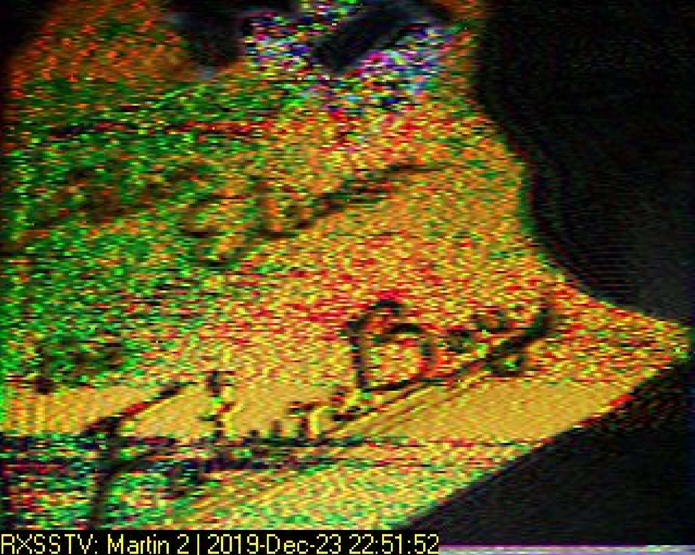

# Forensics

## Glory of the Garden (50 points)

This garden contains more than it seems. You can also find the file in `/problems/glory-of-the-garden_0_25ece79ae00914856938a4b19d0e31af` on the shell server.


FLAG: `picoCTF{more_than_m33ts_the_3y3f089EdF0}`

If we open this image with hex editor, we will see the flag. Alternatively, we can use

```bash
$ strings garden.jpg | grep picoCTF
# => Here is a flag "picoCTF{more_than_m33ts_the_3y3f089EdF0}"
```

## unzip (50 points)

Can you unzip this file and get the flag?

FLAG: `picoCTF{unz1pp1ng_1s_3a5y}`

Unzipping the file, we will get the following image:


## So Meta (150 points)

Find the flag in this picture. You can also find the file in `/problems/so-meta_4_4e8d17dbd28e1fdfe82ba31ceb021615`.


FLAG: `picoCTF{s0_m3ta_9a16fd1d}`

Again, use `strings pico_img.png | grep picoCTF`.

## What Lies Within (150 points)

Theres something in the building. Can you retrieve the flag?


FLAG: `picoCTF{h1d1ng_1n_th3_b1t5}`

The flag is hidden in the least significant bit of each pixel.

The message can be retrieved by `zsteg`.

**Note:** `zsteg` can be installed with gem: `sudo gem install zsteg`.

```bash
$ zsteg buildings.png 
b1,r,lsb,xy         .. text: "^5>R5YZrG"
b1,rgb,lsb,xy       .. text: "picoCTF{h1d1ng_1n_th3_b1t5}"
b1,abgr,msb,xy      .. file: PGP Secret Sub-key -
b2,b,lsb,xy         .. text: "XuH}p#8Iy="
b3,abgr,msb,xy      .. text: "t@Wp-_tH_v\r"
b4,r,lsb,xy         .. text: "fdD\"\"\"\" "
b4,r,msb,xy         .. text: "%Q#gpSv0c05"
b4,g,lsb,xy         .. text: "fDfffDD\"\""
b4,g,msb,xy         .. text: "f\"fff\"\"DD"
b4,b,lsb,xy         .. text: "\"$BDDDDf"
b4,b,msb,xy         .. text: "wwBDDDfUU53w"
b4,rgb,msb,xy       .. text: "dUcv%F#A`"
b4,bgr,msb,xy       .. text: " V\"c7Ga4"
b4,abgr,msb,xy      .. text: "gOC_$_@o"

```

## extensions (150 points)

This is a really weird text file TXT? Can you find the flag?

FLAG: `picoCTF{now_you_know_about_extensions}`

By looking at the first few lines of `flag.txt`, we know that this file should be a png file. Hence, change the extension and open it.


## shark on wire 1 (150 points)

We found this packet capture. Recover the flag. You can also find the file in `/problems/shark-on-wire-1_0_13d709ec13952807e477ba1b5404e620`.

FLAG: `picoCTF{StaT31355_636f6e6e}`

Filter out the UDP packets: `udp.stream eq 6` and look at the contents of all packets. We will find the flag.

## WhitePages (250 points)

I stopped using YellowPages and moved onto WhitePages... but the page they gave me is all blank!

FLAG: `picoCTF{not_all_spaces_are_created_equal_0696a7c2dfa36b081b44603b8aa78efd}`

```
00000000: e280 83e2 8083 e280 83e2 8083 20e2 8083  ............ ...
00000010: 20e2 8083 e280 83e2 8083 e280 83e2 8083   ...............
00000020: 20e2 8083 e280 8320 e280 83e2 8083 e280   ...... ........
00000030: 83e2 8083 20e2 8083 e280 8320 e280 8320  .... ...... ... 
00000040: 2020 e280 83e2 8083 e280 83e2 8083 e280    ..............
00000050: 8320 20e2 8083 20e2 8083 e280 8320 e280  .  ... ...... ..
00000060: 8320 20e2 8083 e280 83e2 8083 2020 e280  .  .........  ..
00000070: 8320 20e2 8083 2020 2020 e280 8320 e280  .  ...    ... ..
00000080: 83e2 8083 e280 83e2 8083 2020 e280 8320  ..........  ... 
00000090: e280 8320 e280 8320 e280 83e2 8083 e280  ... ... ........
000000a0: 8320 e280 83e2 8083 e280 8320 20e2 8083  . .........  ...
000000b0: e280 83e2 8083 e280 83e2 8083 20e2 8083  ............ ...
000000c0: 20e2 8083 e280 83e2 8083 e280 83e2 8083   ...............
000000d0: 20e2 8083 20e2 8083 e280 83e2 8083 e280   ... ...........
000000e0: 83e2 8083 20e2 8083 e280 8320 e280 83e2  .... ...... ....
000000f0: 8083 e280 83e2 8083 20e2 8083 e280 8320  ........ ...... 
00000100: e280 8320 e280 8320 e280 83e2 8083 2020  ... ... ......  
00000110: e280 8320 e280 83e2 8083 e280 8320 e280  ... ......... ..
00000120: 8320 e280 8320 e280 83e2 8083 e280 8320  . ... ......... 
00000130: e280 8320 e280 83e2 8083 20e2 8083 e280  ... ...... .....
00000140: 83e2 8083 e280 83e2 8083 e280 8320 e280  ............. ..
00000150: 8320 e280 83e2 8083 e280 83e2 8083 e280  . ..............
00000160: 8320 e280 8320 e280 8320 e280 8320 e280  . ... ... ... ..
00000170: 8320 e280 83e2 8083 e280 83e2 8083 20e2  . ............ .
00000180: 8083 e280 8320 e280 83e2 8083 2020 e280  ..... ......  ..
00000190: 83e2 8083 e280 8320 e280 83e2 8083 20e2  ....... ...... .
000001a0: 8083 e280 8320 e280 8320 e280 83e2 8083  ..... ... ......
000001b0: e280 83e2 8083 2020 e280 83e2 8083 20e2  ......  ...... .
000001c0: 8083 e280 83e2 8083 e280 83e2 8083 e280  ................
000001d0: 8320 e280 8320 e280 83e2 8083 20e2 8083  . ... ...... ...
000001e0: e280 8320 e280 83e2 8083 e280 8320 e280  ... ......... ..
000001f0: 8320 e280 8320 e280 83e2 8083 e280 83e2  . ... ..........
00000200: 8083 2020 e280 8320 e280 83e2 8083 2020  ..  ... ......  
00000210: 2020 e280 8320 e280 8320 e280 83e2 8083    ... ... ......
00000220: 20e2 8083 e280 8320 e280 83e2 8083 e280   ...... ........
00000230: 8320 e280 83e2 8083 e280 8320 e280 8320  . ......... ... 
00000240: e280 83e2 8083 2020 e280 83e2 8083 20e2  ......  ...... .
00000250: 8083 e280 83e2 8083 e280 83e2 8083 e280  ................
00000260: 83e2 8083 20e2 8083 e280 8320 20e2 8083  .... ......  ...
00000270: e280 83e2 8083 20e2 8083 e280 83e2 8083  ...... .........
00000280: e280 83e2 8083 e280 8320 e280 83e2 8083  ......... ......
00000290: e280 83e2 8083 20e2 8083 e280 8320 e280  ...... ...... ..
000002a0: 83e2 8083 e280 83e2 8083 e280 8320 e280  ............. ..
000002b0: 8320 e280 83e2 8083 e280 83e2 8083 2020  . ............  
000002c0: e280 8320 e280 83e2 8083 20e2 8083 2020  ... ...... ...  
000002d0: e280 8320 e280 83e2 8083 e280 8320 2020  ... .........   
000002e0: e280 8320 e280 8320 e280 83e2 8083 20e2  ... ... ...... .
000002f0: 8083 e280 8320 e280 83e2 8083 2020 2020  ..... ......    
00000300: e280 8320 e280 8320 e280 8320 e280 8320  ... ... ... ... 
00000310: e280 8320 e280 83e2 8083 2020 20e2 8083  ... ......   ...
00000320: e280 8320 e280 83e2 8083 e280 8320 e280  ... ......... ..
00000330: 83e2 8083 e280 83e2 8083 20e2 8083 e280  .......... .....
00000340: 83e2 8083 e280 83e2 8083 e280 8320 e280  ............. ..
00000350: 8320 e280 83e2 8083 20e2 8083 e280 8320  . ...... ...... 
00000360: e280 83e2 8083 e280 8320 e280 8320 e280  ......... ... ..
00000370: 8320 e280 8320 e280 83e2 8083 e280 83e2  . ... ..........
00000380: 8083 e280 8320 e280 83e2 8083 2020 2020  ..... ......    
00000390: e280 8320 e280 8320 e280 83e2 8083 20e2  ... ... ...... .
000003a0: 8083 e280 8320 e280 8320 e280 8320 e280  ..... ... ... ..
000003b0: 83e2 8083 e280 83e2 8083 e280 83e2 8083  ................
000003c0: 20e2 8083 20e2 8083 e280 83e2 8083 e280   ... ...........
000003d0: 83e2 8083 20e2 8083 e280 8320 e280 83e2  .... ...... ....
000003e0: 8083 e280 83e2 8083 20e2 8083 e280 8320  ........ ...... 
000003f0: e280 83e2 8083 2020 e280 8320 e280 8320  ......  ... ... 
00000400: e280 83e2 8083 2020 e280 83e2 8083 e280  ......  ........
00000410: 83e2 8083 e280 83e2 8083 2020 e280 83e2  ..........  ....
00000420: 8083 e280 83e2 8083 e280 83e2 8083 2020  ..............  
00000430: e280 83e2 8083 e280 83e2 8083 e280 83e2  ................
00000440: 8083 20e2 8083 e280 83e2 8083 e280 83e2  .. .............
00000450: 8083 e280 8320 e280 83e2 8083 e280 8320  ..... ......... 
00000460: 20e2 8083 e280 8320 20e2 8083 2020 2020   ......  ...    
00000470: e280 8320 2020 e280 83e2 8083 20e2 8083  ...   ...... ...
00000480: e280 8320 20e2 8083 e280 83e2 8083 20e2  ...  ......... .
00000490: 8083 e280 8320 20e2 8083 e280 8320 e280  .....  ...... ..
000004a0: 8320 e280 8320 2020 e280 83e2 8083 2020  . ...   ......  
000004b0: e280 83e2 8083 20e2 8083 e280 83e2 8083  ...... .........
000004c0: e280 83e2 8083 e280 8320 e280 83e2 8083  ......... ......
000004d0: e280 83e2 8083 e280 8320 e280 8320 2020  ......... ...   
000004e0: e280 8320 20e2 8083 e280 8320 20e2 8083  ...  ......  ...
000004f0: e280 8320 e280 8320 e280 83e2 8083 20e2  ... ... ...... .
00000500: 8083 2020 e280 83e2 8083 e280 83e2 8083  ..  ............
00000510: 20e2 8083 e280 83e2 8083 e280 83e2 8083   ...............
00000520: e280 8320 e280 8320 e280 83e2 8083 e280  ... ... ........
00000530: 83e2 8083 e280 8320 20e2 8083 20e2 8083  .......  ... ...
00000540: e280 8320 e280 8320 2020 e280 8320 e280  ... ...   ... ..
00000550: 83e2 8083 e280 8320 2020 e280 8320 e280  .......   ... ..
00000560: 83e2 8083 e280 8320 2020 e280 83e2 8083  .......   ......
00000570: 2020 e280 8320 20e2 8083 e280 83e2 8083    ...  .........
00000580: 20e2 8083 e280 8320 2020 e280 8320 e280   ......   ... ..
00000590: 8320 e280 8320 2020 e280 83e2 8083 20e2  . ...   ...... .
000005a0: 8083 e280 8320 20e2 8083 e280 8320 2020  .....  ......   
000005b0: e280 8320 20e2 8083 20e2 8083 e280 83e2  ...  ... .......
000005c0: 8083 e280 83e2 8083 20e2 8083 2020 e280  ........ ...  ..
000005d0: 83e2 8083 e280 83e2 8083 20e2 8083 e280  .......... .....
000005e0: 83e2 8083 e280 83e2 8083 e280 8320 e280  ............. ..
000005f0: 8320 e280 83e2 8083 e280 83e2 8083 e280  . ..............
00000600: 8320 e280 83e2 8083 e280 83e2 8083 e280  . ..............
00000610: 8320 e280 83e2 8083 20e2 8083 e280 83e2  . ...... .......
00000620: 8083 e280 83e2 8083 e280 83e2 8083 2020  ..............  
00000630: e280 83e2 8083 e280 8320 e280 83e2 8083  ......... ......
00000640: 2020 e280 8320 e280 8320 e280 83e2 8083    ... ... ......
00000650: 2020 e280 83e2 8083 20e2 8083 e280 83e2    ...... .......
00000660: 8083 2020 e280 83e2 8083 e280 8320 e280  ..  ......... ..
00000670: 83e2 8083 2020 e280 83e2 8083 2020 e280  ....  ......  ..
00000680: 83e2 8083 e280 83e2 8083 20e2 8083 20e2  .......... ... .
00000690: 8083 e280 83e2 8083 e280 83e2 8083 20e2  .............. .
000006a0: 8083 e280 8320 e280 83e2 8083 e280 83e2  ..... ..........
000006b0: 8083 20e2 8083 e280 8320 e280 8320 2020  .. ...... ...   
000006c0: e280 83e2 8083 e280 83e2 8083 e280 8320  ............... 
000006d0: 20e2 8083 20e2 8083 e280 8320 e280 8320   ... ...... ... 
000006e0: 20e2 8083 e280 83e2 8083 2020 e280 8320   .........  ... 
000006f0: 20e2 8083 2020 2020 e280 8320 e280 83e2   ...    ... ....
00000700: 8083 e280 83e2 8083 2020 e280 8320 e280  ........  ... ..
00000710: 8320 e280 8320 e280 83e2 8083 e280 8320  . ... ......... 
00000720: e280 83e2 8083 e280 8320 20e2 8083 e280  .........  .....
00000730: 8320 2020 20e2 8083 2020 e280 8320 20e2  .    ...  ...  .
00000740: 8083 2020 20e2 8083 e280 8320 20e2 8083  ..   ......  ...
00000750: 2020 2020 e280 8320 2020 e280 8320 e280      ...   ... ..
00000760: 83e2 8083 e280 8320 e280 8320 2020 2020  ....... ...     
00000770: e280 8320 20e2 8083 e280 83e2 8083 e280  ...  ...........
00000780: 8320 e280 8320 20e2 8083 2020 e280 83e2  . ...  ...  ....
00000790: 8083 e280 8320 20e2 8083 2020 e280 83e2  .....  ...  ....
000007a0: 8083 e280 8320 e280 8320 2020 2020 e280  ..... ...     ..
000007b0: 8320 2020 e280 83e2 8083 2020 e280 8320  .   ......  ... 
000007c0: 2020 e280 83e2 8083 e280 83e2 8083 e280    ..............
000007d0: 8320 20e2 8083 e280 83e2 8083 e280 8320  .  ............ 
000007e0: e280 8320 20e2 8083 e280 83e2 8083 2020  ...  .........  
000007f0: e280 8320 20e2 8083 e280 8320 e280 8320  ...  ...... ... 
00000800: e280 8320 2020 e280 83e2 8083 2020 e280  ...   ......  ..
00000810: 8320 e280 8320 2020 2020 e280 8320 20e2  . ...     ...  .
00000820: 8083 e280 83e2 8083 e280 8320 e280 8320  ........... ... 
00000830: 2020 e280 83e2 8083 20e2 8083 e280 8320    ...... ...... 
00000840: 20e2 8083 e280 8320 e280 8320 e280 8320   ...... ... ... 
00000850: e280 8320 2020 2020 e280 8320 20e2 8083  ...     ...  ...
00000860: e280 83e2 8083 2020 e280 8320 2020 e280  ......  ...   ..
00000870: 83e2 8083 20e2 8083 e280 8320 20e2 8083  .... ......  ...
00000880: e280 8320 e280 8320 e280 8320 20e2 8083  ... ... ...  ...
00000890: e280 83e2 8083 e280 8320 e280 8320 2020  ......... ...   
000008a0: e280 8320 e280 83e2 8083 e280 8320 20e2  ... .........  .
000008b0: 8083 e280 8320 e280 8320 e280 8320 20e2  ..... ... ...  .
000008c0: 8083 e280 8320 e280 83e2 8083 e280 8320  ..... ......... 
000008d0: e280 8320 2020 2020 e280 8320 20e2 8083  ...     ...  ...
000008e0: e280 8320 e280 8320 e280 8320 2020 e280  ... ... ...   ..
000008f0: 83e2 8083 e280 8320 e280 8320 2020 e280  ....... ...   ..
00000900: 8320 e280 8320 e280 8320 20e2 8083 e280  . ... ...  .....
00000910: 83e2 8083 e280 8320 e280 8320 20e2 8083  ....... ...  ...
00000920: 2020 e280 83e2 8083 e280 8320 e280 8320    ......... ... 
00000930: 2020 2020 e280 83e2 8083 2020 e280 83e2      ......  ....
00000940: 8083 e280 83e2 8083 e280 83e2 8083 2020  ..............  
00000950: e280 8320 20e2 8083 e280 83e2 8083 2020  ...  .........  
00000960: 20e2 8083 e280 8320 e280 83e2 8083 2020   ...... ......  
00000970: e280 8320 20e2 8083 e280 8320 20e2 8083  ...  ......  ...
00000980: e280 83e2 8083 e280 8320 e280 83e2 8083  ......... ......
00000990: 2020 e280 8320 2020 e280 8320 20e2 8083    ...   ...  ...
000009a0: e280 83e2 8083 2020 e280 83e2 8083 2020  ......  ......  
000009b0: e280 83e2 8083 20e2 8083 e280 8320 20e2  ...... ......  .
000009c0: 8083 e280 8320 e280 83e2 8083 e280 8320  ..... ......... 
000009d0: 20e2 8083 e280 8320 20e2 8083 e280 8320   ......  ...... 
000009e0: 20e2 8083 e280 83e2 8083 e280 8320 e280   ............ ..
000009f0: 83e2 8083 2020 e280 83e2 8083 2020 e280  ....  ......  ..
00000a00: 83e2 8083 2020 e280 8320 20e2 8083 e280  ....  ...  .....
00000a10: 8320 20e2 8083 e280 83e2 8083 20e2 8083  .  ......... ...
00000a20: e280 83e2 8083 2020 e280 83e2 8083 e280  ......  ........
00000a30: 83e2 8083 e280 83e2 8083 2020 20e2 8083  ..........   ...
00000a40: e280 83e2 8083 e280 83e2 8083 2020 e280  ............  ..
00000a50: 83e2 8083 e280 8320 e280 8320 20e2 8083  ....... ...  ...
00000a60: e280 83e2 8083 20e2 8083 e280 83e2 8083  ...... .........
00000a70: 2020 e280 8320 e280 83e2 8083 e280 83e2    ... ..........
00000a80: 8083 2020 e280 8320 e280 83e2 8083 e280  ..  ... ........
00000a90: 83e2 8083 2020 e280 8320 20e2 8083 e280  ....  ...  .....
00000aa0: 83e2 8083 2020 e280 83e2 8083 e280 83e2  ....  ..........
00000ab0: 8083 e280 83e2 8083 2020 e280 83e2 8083  ........  ......
00000ac0: 2020 e280 8320 20e2 8083 e280 83e2 8083    ...  .........
00000ad0: 20e2 8083 e280 83e2 8083 2020 20e2 8083   .........   ...
00000ae0: e280 83e2 8083 e280 8320 20e2 8083 e280  .........  .....
00000af0: 83e2 8083 e280 8320 e280 8320 20e2 8083  ....... ...  ...
00000b00: e280 83e2 8083 e280 8320 e280 83e2 8083  ......... ......
00000b10: 2020 e280 8320 2020 e280 83e2 8083 2020    ...   ......  
00000b20: 20e2 8083 e280 83e2 8083 e280 8320 20e2   ............  .
00000b30: 8083 e280 8320 e280 8320 e280 8320 20e2  ..... ... ...  .
00000b40: 8083 e280 8320 20e2 8083 e280 8320 20e2  .....  ......  .
00000b50: 8083 e280 8320 e280 83e2 8083 e280 8320  ..... ......... 
00000b60: 2020 2020 e280 8320 e280 83e2 8083 e280      ... ........
00000b70: 83e2 8083 20e2 8083 20e2 8083 e280 83e2  .... ... .......
00000b80: 8083 e280 83e2 8083 20e2 8083 e280 8320  ........ ...... 
00000b90: e280 83e2 8083 e280 83e2 8083 20e2 8083  ............ ...
00000ba0: e280 8320                                ... 
```

It is really easy for us to see a pattern here: `e28083` and `20`. Hence, we can use the following script to convert `e28083` to be `0`, and `20` to be `1`.

```python3
with open('whitepages.txt', 'rb') as f:
    data = f.read()

data = data.replace(b'\xe2\x80\x83', b'0')
data = data.replace(b'\x20', b'1')

value = format(int(data, 2), 'x')
if len(value) % 2 == 1:
    value = '0' + value
value = bytes.fromhex(value)

chars = [value[2*i:2*i+2] for i in range(len(value) // 2)]

print(b''.join(chars).decode('utf-8'))
```

Run the script and we get the result:

```
$ python3 whitepage_solver.py 

        picoCTF

        SEE PUBLIC RECORDS & BACKGROUND REPORT
        5000 Forbes Ave, Pittsburgh, PA 15213
        picoCTF{not_all_spaces_are_created_equal_0696a7c2dfa36b081b44603b8aa78efd}
        

```

**Note:** To install `pwn` for python3, use the following command: `python3 pip install --upgrade git+https://github.com/arthaud/python3-pwntools.git`

## c0rrupt (250 points)

We found this file. Recover the flag. You can also find the file in `/problems/c0rrupt_0_1fcad1344c25a122a00721e4af86de13`.

FLAG: `picoCTF{c0rrupt10n_1847995}`

First, let's check the type of the file.

```bash
$ file mystery
# => mystery: data
```

Next, let's see the content of the file.

```bash
$ xxd mystery | head
00000000: 8965 4e34 0d0a b0aa 0000 000d 4322 4452  .eN4........C"DR
00000010: 0000 066a 0000 0447 0802 0000 007c 8bab  ...j...G.....|..
00000020: 7800 0000 0173 5247 4200 aece 1ce9 0000  x....sRGB.......
00000030: 0004 6741 4d41 0000 b18f 0bfc 6105 0000  ..gAMA......a...
00000040: 0009 7048 5973 aa00 1625 0000 1625 0149  ..pHYs...%...%.I
00000050: 5224 f0aa aaff a5ab 4445 5478 5eec bd3f  R$......DETx^..?
00000060: 8e64 cd71 bd2d 8b20 2080 9041 8302 08d0  .d.q.-.  ..A....
00000070: f9ed 40a0 f36e 407b 9023 8f1e d720 8b3e  ..@..n@{.#... .>
00000080: b7c1 0d70 0374 b503 ae41 6bf8 bea8 fbdc  ...p.t...Ak.....
00000090: 3e7d 2a22 336f de5b 55dd 3d3d f920 9188  >}*"3o.[U.==. ..

```

Looks like a PNG file. Open the file with a hex editor to modify the file. I'm using hex fiend here.

```bash
$ cp mystery fixed.png
$ hexf fixed.png
```

The first eight bytes is the PNG signature. They should always be `89  50  4e  47  0d  0a  1a  0a` (`\211   P   N   G  \r  \n \032 \n`). The header `C"DR` should be modified to be `IHDR`. Details about png format can be found [here](https://www.w3.org/TR/2003/REC-PNG-20031110/).

Now, if we check the file type, we will see

```bash
$ file fixed.png
# => fixed.png: PNG image data, 1642 x 1095, 8-bit/color RGB, non-interlaced
```

Use `pngcheck` to check if the png file has any error left.

```bash
$ pngcheck -c -f -v fixed.png 
File: fixed.png (202940 bytes)
  chunk IHDR at offset 0x0000c, length 13
    1642 x 1095 image, 24-bit RGB, non-interlaced
  chunk sRGB at offset 0x00025, length 1
    rendering intent = perceptual
  chunk gAMA at offset 0x00032, length 4: 0.45455
  chunk pHYs at offset 0x00042, length 9: 2852132389x5669 pixels/meter
  CRC error in chunk pHYs (computed 38d82c82, expected 495224f0)
:  invalid chunk length (too large)
ERRORS DETECTED in fixed.png

```

Let's first look at the pHYs chunk. According to W3C, we know:

```
The pHYs chunk specifies the intended pixel size or aspect ratio for display of the image. It contains:

Pixels per unit, X axis   4 bytes (PNG unsigned integer)
Pixels per unit, Y axis   4 bytes (PNG unsigned integer)
Unit specifier            1 byte
```

If we compare the 4 bytes of X axis and 4 bytes of Y axis, we will notice that they are different:

```
AA 00 16 25  - X axis
00 00 16 25  - Y axis
```

It seems like X axis is too large. Maybe that is the cause of the CRC error. Change `AA` to `00`, and the problem is fixed!

```bash
$ pngcheck -c -f -v fixed.png 
File: fixed.png (202940 bytes)
  chunk IHDR at offset 0x0000c, length 13
    1642 x 1095 image, 24-bit RGB, non-interlaced
  chunk sRGB at offset 0x00025, length 1
    rendering intent = perceptual
  chunk gAMA at offset 0x00032, length 4: 0.45455
  chunk pHYs at offset 0x00042, length 9: 5669x5669 pixels/meter (144 dpi)
:  invalid chunk length (too large)
ERRORS DETECTED in fixed.png

```

However, we still have this `invalid chunk length (too large)` error. Look at the data coming after the pHYs chunk.

```
AA AA FF A5  -> chunk size
AB 44 45 54  -> header type
```

Notice that the header type is illegal and the closest type is called `IDAT`. Another point that we need to notice is the large length field. To find the correct length, we can use `binwalk` to find the location of different `IDAT` chunks, since they must be consecutive.

```bash
$ binwalk -R "IDAT" fixed.png 

DECIMAL       HEXADECIMAL     DESCRIPTION
--------------------------------------------------------------------------------
87            0x57            Raw signature (IDAT)
65544         0x10008         Raw signature (IDAT)
131080        0x20008         Raw signature (IDAT)
196616        0x30008         Raw signature (IDAT)

```

Hence, the data of the first `IDAT` chunk starts from `0x5B` and ends at `0x10008 - 0x4 - 0x4 = 0x10000`. The first `0x4` is for the `length` field and the second one is for the `checksum` field. Hence, the length of the data should be `0x10000 - 0x5B = 0xFFA5`. Make the modifications and check the file again.

```bash
$ pngcheck fixed.png 
OK: fixed.png (1642x1095, 24-bit RGB, non-interlaced, 96.3%).
```

Open the file and we will get the flag.


**Note:** Below is some relevant info about PNG.

```
5.2 PNG Signature
89 50 4E 47 0D 0A 1A 0A (translated to hex)
This signature indicates that the remainder of the datastream contains a single PNG image, consisting of a series of chunks beginning with an IHDR chunk and ending with an IEND chunk.

5.3 PNG Chunk Layout
Each chunk consists of three or four fields.
LENGTH-CHUNKTYPE-CHUNKDATA-CRC
or
LENGTH(=0)-CHUNKTYPE-CRC
The length field is a four byte integer giving the length of the chunkdata field.
Chunktype is a four byte sequence defining the chunk type.
Chunkdata gives data for the image.
crc is a four byte sequence which uses an algorithm on the preceding bytes to check for corruption in the data.

5.6 Chunk Ordering
Critical chunks
(shall appear in this order, except PLTE is optional)
Chunk name    Multiple allowed        Ordering constraints
IHDR          No                      Shall be first
PLTE          No                      Before first IDAT
IDAT          Yes                     Multiple IDAT chunks shall be consecutive
IEND          No                      Shall be last

Ancillary chunks
(need not appear in this order)
Chunk name    Multiple allowed        Ordering constraints
cHRM          No                      Before PLTE and IDAT
gAMA          No                      Before PLTE and IDAT
iCCP          No                      Before PLTE and IDAT. If the iCCP chunk is present, the sRGB chunk should not be present.
sBIT          No                      Before PLTE and IDAT
sRGB          No                      Before PLTE and IDAT. If the sRGB chunk is present, the iCCP chunk should not be present.
bKGD          No                      After PLTE; before IDAT
hIST          No                      After PLTE; before IDAT
tRNS          No                      After PLTE; before IDAT
pHYs          No                      Before IDAT
sPLT          Yes                     Before IDAT
tIME          No                      None
iTXt          Yes                     None
tEXt          Yes                     None
zTXt          Yes                     None
```

## like1000 (250 points)

This .tar file got tarred alot. Also available at `/problems/like1000_0_369bbdba2af17750ddf10cc415672f1c`.

FLAG: `picoCTF{l0t5_0f_TAR5}`

```bash
$ for i in $(seq 1000 1) ; do tar xvf "${i}.tar"; done
$ rm -rf {1..999}.tar
$ rm -rf filler.txt
```

We will get an image called `flag.png`. Open it and we will get the flag.


## m00nwalk (250 points)

Decode this message from the moon. You can also find the file in `/problems/m00nwalk_1_727ca48dac5da21d2c11635238649314`.

FLAG: `picoCTF{beep_boop_im_in_space}`

I used a software called RX-SSTV to decode this audio file into an image.


**Note:** The answer to the hint *What is the CMU mascot?* is *Scotty the Scottie Dog*. Hence, we should choose `scottie`.

## Investigative Reversing 0 (300 points)

We have recovered a binary and an image. See what you can make of it. There should be a flag somewhere. Its also found in `/problems/investigative-reversing-0_5_5cc04ac6883dd5a1d0bb9024323b6734` on the shell server.

FLAG: `picoCTF{f0und_1t_9de03050}`

Use Ghidra to reverse engineer the binary file and we will get the following code.

```c
void main(void)

{
  FILE *__stream;
  FILE *__stream_00;
  size_t sVar1;
  long in_FS_OFFSET;
  int local_54;
  int local_50;
  char local_38 [4];
  char local_34;
  char local_33;
  char local_29;
  long local_10;
  
  local_10 = *(long *)(in_FS_OFFSET + 0x28);
  __stream = fopen("flag.txt","r");
  __stream_00 = fopen("mystery.png","a");
  if (__stream == (FILE *)0x0) {
    puts("No flag found, please make sure this is run on the server");
  }
  if (__stream_00 == (FILE *)0x0) {
    puts("mystery.png is missing, please run this on the server");
  }
  sVar1 = fread(local_38,0x1a,1,__stream);
  if ((int)sVar1 < 1) {
                    /* WARNING: Subroutine does not return */
    exit(0);
  }
  puts("at insert");
  fputc((int)local_38[0],__stream_00);
  fputc((int)local_38[1],__stream_00);
  fputc((int)local_38[2],__stream_00);
  fputc((int)local_38[3],__stream_00);
  fputc((int)local_34,__stream_00);
  fputc((int)local_33,__stream_00);
  local_54 = 6;
  while (local_54 < 0xf) {
    fputc((int)(char)(local_38[local_54] + '\x05'),__stream_00);
    local_54 = local_54 + 1;
  }
  fputc((int)(char)(local_29 + -3),__stream_00);
  local_50 = 0x10;
  while (local_50 < 0x1a) {
    fputc((int)local_38[local_50],__stream_00);
    local_50 = local_50 + 1;
  }
  fclose(__stream_00);
  fclose(__stream);
  if (local_10 != *(long *)(in_FS_OFFSET + 0x28)) {
                    /* WARNING: Subroutine does not return */
    __stack_chk_fail();
  }
  return;
}

```

From this code, we know that the binary file reads the flag and append it to the end of the image file. However, some bytes have been changed.

The bytes that correspond to the flag is `70 69 63 6F 43 54 4B 80 6B 35 7A 73 69 64 36 71 5F 39 64 65 30 33 30 35 30 7D`. We can use the following script to decode it and get the original value:

```python3
data = "70 69 63 6F 43 54 4B 80 6B 35 7A 73 69 64 36 71 5F 39 64 65 30 33 30 35 30 7D"
arr = bytearray(bytes.fromhex(data.replace(' ', '')))
for i in range(6, 0xf):
    arr[i] = arr[i] - 0x5
arr[0xf] = arr[0xf] + 3
print(arr)

# => bytearray(b'picoCTF{f0und_1t_9de03050}')
```

## m00nwalk2 (300 points)

Revisit the last transmission. We think this transmission contains a hidden message. There are also some clues clue 1, clue 2, clue 3. You can also find the files in `/problems/m00nwalk2_1_ee6747feaad7bc16aa5ca2743ecd9652`.

FLAG: `picoCTF{the_answer_lies_hidden_in_plain_sight}`

Using the same tool to decode the clues, we get the following:

*Clue 1*


```
Password
hidden stegosaurus
```

*Clue 2*


```
The quieter you are
the more you can hear
```

*Clue 3*



```
Alan Eliasen
the
FutureBoy
```

Hence, we know from the clue that some message is hidden inside *message.wav* file. We can use [this website](https://futureboy.us/stegano/decinput.html) created by *Alan Eliasen* to extract the message. The passcode for the extraction should be `hidden_stegosaurus`. After the extraction, we will get the flag.

## shark on wire 2 (300 points)

We found this packet capture. Recover the flag that was pilfered from the network. You can also find the file in `/problems/shark-on-wire-2_0_3e92bfbdb2f6d0e25b8d019453fdbf07`.

FLAG: `picoCTF{p1LLf3r3d_data_v1a_st3g0}`

By analyzing the packet through wireshark, we found a special packet No. 1104 contains a string `start` in its payload. Correspondingly, packet No. 1303 contains a string `{end`. Also, notice that while packets from other ip addresses have a stable port number, those from `10.0.0.66` constantly changes their ports. Hence, the last three digits of each port number from this ip can be a part of the flag.

The port numbers are as follows (first digit removed):

```
112, 105, 099, 111, 067, 084, 070, 123, 112, 049, 076, 076, 102, 051, 114, 051, 100, 095, 100, 097, 116, 097, 095, 118, 049, 097, 095, 115, 116, 051, 103, 048, 125
```

Now, we can translate this with the following python3 script.

```python3
s = "112, 105, 099, 111, 067, 084, 070, 123, 112, 049, 076, 076, 102, 051, 114, 051, 100, 095, 100, 097, 116, 097, 095, 118, 049, 097, 095, 115, 116, 051, 103, 048, 125".split(', ')
values = map(chr, map(int, s))
print(''.join(values))

# => picoCTF{p1LLf3r3d_data_v1a_st3g0}
```

## Investigative Reversing 1 (350 points)

We have recovered a binary and a few images: image, image2, image3. See what you can make of it. There should be a flag somewhere. Its also found in `/problems/investigative-reversing-1_6_34d37d1ca09ecad8586f81060529b1bd` on the shell server.

FLAG: `picoCTF{An0tha_1_8aa498d9}`

Again, use Ghidra to reverse engineer `mystery` and we will get the following c code.

*mystery*

```c
void main(void)

{
  FILE *__stream;
  FILE *__stream_00;
  FILE *__stream_01;
  FILE *__stream_02;
  long in_FS_OFFSET;
  char local_6b;
  int local_68;
  int local_64;
  int local_60;
  char local_38 [4];
  char local_34;
  char local_33;
  long local_10;
  
  local_10 = *(long *)(in_FS_OFFSET + 0x28);
  __stream = fopen("flag.txt","r");
  __stream_00 = fopen("mystery.png","a");
  __stream_01 = fopen("mystery2.png","a");
  __stream_02 = fopen("mystery3.png","a");
  if (__stream == (FILE *)0x0) {
    puts("No flag found, please make sure this is run on the server");
  }
  if (__stream_00 == (FILE *)0x0) {
    puts("mystery.png is missing, please run this on the server");
  }
  fread(local_38,0x1a,1,__stream);
  fputc((int)local_38[1],__stream_02);
  fputc((int)(char)(local_38[0] + '\x15'),__stream_01);
  fputc((int)local_38[2],__stream_02);
  local_6b = local_38[3];
  fputc((int)local_33,__stream_02);
  fputc((int)local_34,__stream_00);
  local_68 = 6;
  while (local_68 < 10) {
    local_6b = local_6b + '\x01';
    fputc((int)local_38[local_68],__stream_00);
    local_68 = local_68 + 1;
  }
  fputc((int)local_6b,__stream_01);
  local_64 = 10;
  while (local_64 < 0xf) {
    fputc((int)local_38[local_64],__stream_02);
    local_64 = local_64 + 1;
  }
  local_60 = 0xf;
  while (local_60 < 0x1a) {
    fputc((int)local_38[local_60],__stream_00);
    local_60 = local_60 + 1;
  }
  fclose(__stream_00);
  fclose(__stream);
  if (local_10 != *(long *)(in_FS_OFFSET + 0x28)) {
                    /* WARNING: Subroutine does not return */
    __stack_chk_fail();
  }
  return;
}

```

We know the c code is again writting the flag into the flags. Hence, we can use the following python3 script to extract the flag.

```python3
import os
import mmap

class Mystery:
    def __init__(self, fname):
        fs = os.path.getsize(fname)
        fd = os.open(fname, os.O_RDONLY)
        end = b'IEND'

        self.map = mmap.mmap(fd, fs, access=mmap.ACCESS_READ)
        self.buffer = self.map[self.map.find(end) + len(end) + 4:]  # CRC length = 4
        self.offset = 0

    def read_byte(self):
        byte = self.buffer[self.offset]
        self.offset += 1
        return byte

    def __del__(self):
        self.map.close()


def main():
    # By counting the number of times fputc has been called, the length of
    # the flag should be 26

    flag = [0 for _ in range(26)]
    
    m0_stream = Mystery("mystery.png")
    m1_stream = Mystery("mystery2.png")
    m2_stream = Mystery("mystery3.png")

    flag[1] = m2_stream.read_byte()
    flag[0] = m1_stream.read_byte() - 0x15
    flag[2] = m2_stream.read_byte()
    flag[5] = m2_stream.read_byte()
    flag[4] = m0_stream.read_byte()

    for i in range(6, 10):
        flag[i] = m0_stream.read_byte()

    flag[3] = m1_stream.read_byte() - (10 - 6) * 0x1

    for i in range(10, 0xf):
        flag[i] = m2_stream.read_byte()

    for i in range(0xf, 0x1a):
        flag[i] = m0_stream.read_byte()

    print(''.join(map(chr, flag)))


if __name__ == '__main__':

    main()

# => picoCTF{An0tha_1_8aa498d9}

```

## Investigative Reversing 2 (350 points)


## WebNet0 (350 points)

## pastaAAA (350 points)

This pasta is up to no good. There MUST be something behind it.


FLAG: `picoCTF{pa$ta_1s_lyf3}`

Use the `stegsolve` tool in `pastaAAA/` to analyze the pasta image. We will see the following image when we look at the green pane.


Hence, the flag should be `picoCTF{pa$ta_1s_lyf3}`.

