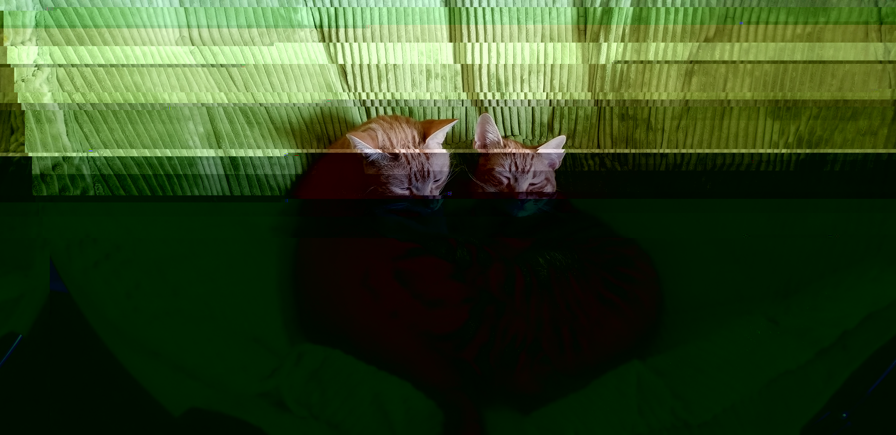

# General Skills

## The Factory's Secret (1 point)

There appear to be some mysterious glyphs hidden inside this abandoned factory... I wonder what would happen if you collected them all?

FLAG: `picoCTF{zerozerozerozero}`

There is a morse code hidden in General Skills section. The code is as follows:

```
.--. .. .-.. .-.. .- .-. ..--- ....- .---- ...--
# => PILLAR2413
```

Hence, the order to open the switches in Reverse Engineering Section should be `2413`.

After collecting all the pieces of the original QR code, we get the following:


The QR code contains message `password: xmfv53uqkf621gakvh502gxfu1g78glds`.

Hence, we can go back to the first room of the game and enter the password to the computer there.

Based on the conversation among the characters, the passcode should be `zerozerozerozero`.

## 2Warm (50 points)

Can you convert the number 42 (base 10) to binary (base 2)?

FLAG: `picoCTF{101010}`

```python3
>>> bin(42)
# => '0b101010'
```

## Lets Warm Up (50 points)

If I told you a word started with 0x70 in hexadecimal, what would it start with in ASCII?

FLAG: `picoCTF{p}`

```python3
>>> chr(0x70)
# => 'p'
```

## Warmed Up (50 points)

What is 0x3D (base 16) in decimal (base 10).

FLAG: `picoCTF{61}`

```python3
>>> 0x3D
# => 61
```

## Bases (100 points)

What does this `bDNhcm5fdGgzX3IwcDM1` mean? I think it has something to do with bases.

FLAG: `picoCTF{l3arn_th3_r0p35}`

```bash
$ echo bDNhcm5fdGgzX3IwcDM1 | base64 -D
# => l3arn_th3_r0p35
```

## First Grep (100 points)
 
Can you find the flag in file? This would be really tedious to look through manually, something tells me there is a better way. You can also find the file in `/problems/first-grep_6_c2319e8af66fa6bec197edc733dd52dd` on the shell server.

FLAG: `picoCTF{grep_is_good_to_find_things_cdb327ab}`

```bash
$ grep pico /problems/first-grep_6_c2319e8af66fa6bec197edc733dd52dd/file
# => picoCTF{grep_is_good_to_find_things_cdb327ab}
```

## Resources (100 points)

We put together a bunch of resources to help you out on our website! If you go over there, you might even find a flag! https://picoctf.com/resources ([link](https://picoctf.com/resources)).

FLAG: `picoCTF{r3source_pag3_f1ag}`

Just go to that website.

## strings it (100 points)

Can you find the flag in file without running it? You can also find the file in `/problems/strings-it_5_1fd17da9526a76a4fffce289dee10fbb` on the shell server.

FLAG: `picoCTF{5tRIng5_1T_dd38f284}`

```bash
$ strings /problems/strings-it_5_1fd17da9526a76a4fffce289dee10fbb/strings | grep pico
# => picoCTF{5tRIng5_1T_dd38f284}
```

## what's a net cat? (100 points)

Using netcat (nc) is going to be pretty important. Can you connect to `2019shell1.picoctf.com` at port `32225` to get the flag?

FLAG: `picoCTF{nEtCat_Mast3ry_b1d25ece}`

```bash
$ nc 2019shell1.picoctf.com 32225
# => picoCTF{nEtCat_Mast3ry_b1d25ece}
```

## Based (200 points)
 
To get truly 1337, you must understand different data encodings, such as hexadecimal or binary. Can you get the flag from this program to prove you are on the way to becoming 1337? Connect with `nc 2019shell1.picoctf.com 20836`.

FLAG: `picoCTF{learning_about_converting_values_6cdcad0d}`


```python3
# Python version: 2.7

import pwn
  
# Connect to the server

sh = pwn.remote("2019shell1.picoctf.com", 20836)

# Receive data

data = sh.recvuntil('Input:\n')
text = data.split('\n')[2].split()[3:-3]
translated = ''.join(map(chr, map(lambda v: int(v, 2), text)))
sh.sendline(translated)

data = sh.recvuntil('Input:\n')
text = data.split('\n')[0].split()[4:-3]
translated = ''.join(map(chr, map(lambda v: int(v, 8), text)))
sh.sendline(translated)

data = sh.recvuntil('Input:\n')
text = data.split('\n')[0].split()[4]
translated = text.decode('hex')
sh.sendline(translated)

sh.interactive()
```

```
$ python based.py 
[+] Opening connection to 2019shell1.picoctf.com on port 20836: Done
[*] Switching to interactive mode
You've beaten the challenge
Flag: picoCTF{learning_about_converting_values_6cdcad0d}
[*] Got EOF while reading in interactive
$ exit
$ exit
[*] Closed connection to 2019shell1.picoctf.com port 20836
[*] Got EOF while sending in interactive
```

## First Grep: Part II (200 points)

Can you find the flag in `/problems/first-grep--part-ii_6_84224d7d745e41d24bde7e7bc7062bbe/files` on the shell server? Remember to use grep.

FLAG: `picoCTF{grep_r_to_find_this_5241c61f}`

```bash
$ grep -r pico /problems/first-grep--part-ii_6_84224d7d745e41d24bde7e7bc7062bbe/files
# => /problems/first-grep--part-ii_6_84224d7d745e41d24bde7e7bc7062bbe/files/files2/file24:picoCTF{grep_r_to_find_this_5241c61f}
```

## plumbing (200 points)

Sometimes you need to handle process data outside of a file. Can you find a way to keep the output from this program and search for the flag? Connect to `2019shell1.picoctf.com 21957`.

FLAG: `picoCTF{digital_plumb3r_c1082838}`

```bash
$ nc 2019shell1.picoctf.com 21957 | grep pico
# => picoCTF{digital_plumb3r_c1082838}
```

## whats-the-difference (200 points)

Can you spot the difference? kitters cattos. They are also available at `/problems/whats-the-difference_0_00862749a2aeb45993f36cc9cf98a47a` on the shell server.

FLAG: `picoCTF{th3yr3_a5_d1ff3r3nt_4s_bu773r_4nd_j311y_aslkjfdsalkfslkflkjdsfdszmz10548}`

*kitters*


*cattos*



Notice that kitters looks alright and cattos looks corrupted. Hence, there must be some data modified in cattos and the difference will make up the flag.

```python3
kitters = open('kitters.jpg', 'rb').read()
cattos = open('cattos.jpg', 'rb').read()

flag = ""

for i in range(min(len(kitters), len(cattos))):
    if kitters[i] != cattos[i]:
        flag += chr(cattos[i])

print(flag)

# result:
# picoCTF{th3yr3_a5_d1ff3r3nt_4s_bu773r_4nd_j311y_aslkjfdsalkfslkflkjdsfdszmz10548}
```

## where-is-the-file (200 points)

I've used a super secret mind trick to hide this file. Maybe something lies in `/problems/where-is-the-file_2_f1aa319cafd4b55ee4a60c1ba65255e2`.

FLAG: `picoCTF{w3ll_that_d1dnt_w0RK_30444bc6}`

```bash
$ grep -r pico /problems/where-is-the-file_2_f1aa319cafd4b55ee4a60c1ba65255e2
# => /problems/where-is-the-file_2_f1aa319cafd4b55ee4a60c1ba65255e2/.cant_see_me:picoCTF{w3ll_that_d1dnt_w0RK_30444bc6}
$ # Command `ls -a` can also be used here
```

## flag_shop (300 points)

There's a flag shop selling stuff, can you buy a flag? Source. Connect with `nc 2019shell1.picoctf.com 14937`.

FLAG: `picoCTF{m0n3y_bag5_e062f0fd}`

source:

```c
#include <stdio.h>
#include <stdlib.h>

int main() {
    setbuf(stdout, NULL);
    
    int con;
    con = 0;
    int account_balance = 1100;
    
    while (con == 0) {
        printf("Welcome to the flag exchange\n");
        printf("We sell flags\n");
        printf("\n1. Check Account Balance\n");
        printf("\n2. Buy Flags\n");
        printf("\n3. Exit\n");
    
        int menu;
        printf("\n Enter a menu selection\n");
        fflush(stdin);
        scanf("%d", & menu);

        if (menu == 1) {
            printf("\n\n\n Balance: %d \n\n\n", account_balance);
        } else if (menu == 2) {
            printf("Currently for sale\n");
            printf("1. Defintely not the flag Flag\n");
            printf("2. 1337 Flag\n");
    
            int auction_choice;
            fflush(stdin);
            scanf("%d", & auction_choice);

            if (auction_choice == 1) {
                printf("These knockoff Flags cost 900 each, enter desired quantity\n");
                
                int number_flags = 0;
                fflush(stdin);
                scanf("%d", & number_flags);

                if (number_flags > 0) {
                    int total_cost = 0;
                    total_cost = 900 * number_flags;
                
                    printf("\nThe final cost is: %d\n", total_cost);
                
                    if (total_cost <= account_balance) {
                
                        account_balance = account_balance - total_cost;
                        printf("\nYour current balance after transaction: %d\n\n", account_balance);

                    } else {
                        printf("Not enough funds to complete purchase\n");
                    }
                }
            } else if (auction_choice == 2) {
                printf("1337 flags cost 100000 dollars, and we only have 1 in stock\n");
                printf("Enter 1 to buy one");

                int bid = 0;
                fflush(stdin);
                scanf("%d", & bid);

                if (bid == 1) {
                    if (account_balance > 100000) {
                        FILE * f = fopen("flag.txt", "r");

                        if (f == NULL) {
                            printf("flag not found: please run this on the server\n");
                            exit(0);
                        }
                        
                        char buf[64];
                        fgets(buf, 63, f);
                        printf("YOUR FLAG IS: %s\n", buf);
                    } else {
                        printf("\nNot enough funds for transaction\n\n\n");
                    }
                }
            }
        } else {
            con = 1;
        }
    }
    return 0;
}
```

For this problem, we need to use integer overflow to change our account balance. 

```c
total_cost = 900 * number_flags;
```

```python3
>>> total_cost = (1 << 31) * 1.5
>>> num_flags = total_cost // 900
>>> num_flags
# => 3579139
```

```
$ nc 2019shell1.picoctf.com 14937
Welcome to the flag exchange
We sell flags

1. Check Account Balance

2. Buy Flags

3. Exit

 Enter a menu selection
2
Currently for sale
1. Defintely not the flag Flag
2. 1337 Flag
1
These knockoff Flags cost 900 each, enter desired quantity
3579139                        

The final cost is: -1073742196

Your current balance after transaction: 1073743296

Welcome to the flag exchange
We sell flags

1. Check Account Balance

2. Buy Flags

3. Exit

 Enter a menu selection
2
Currently for sale
1. Defintely not the flag Flag
2. 1337 Flag
2
1337 flags cost 100000 dollars, and we only have 1 in stock
Enter 1 to buy one1
YOUR FLAG IS: picoCTF{m0n3y_bag5_e062f0fd}
Welcome to the flag exchange
We sell flags

1. Check Account Balance

2. Buy Flags

3. Exit

 Enter a menu selection
3

```

## music (300 points)
 
I wrote you a song. Put it in the picoCTF{} flag format

FLAG: `picoCTF{rrrocknrn0113r}`

lyrics.txt

```
Pico's a CTFFFFFFF
my mind is waitin
It's waitin

Put my mind of Pico into This
my flag is not found
put This into my flag
put my flag into Pico


shout Pico
shout Pico
shout Pico

My song's something
put Pico into This

Knock This down, down, down
put This into CTF

shout CTF
my lyric is nothing
Put This without my song into my lyric
Knock my lyric down, down, down

shout my lyric

Put my lyric into This
Put my song with This into my lyric
Knock my lyric down

shout my lyric

Build my lyric up, up ,up

shout my lyric
shout Pico
shout It

Pico CTF is fun
security is important
Fun is fun
Put security with fun into Pico CTF
Build Fun up
shout fun times Pico CTF
put fun times Pico CTF into my song

build it up

shout it
shout it

build it up, up
shout it
shout Pico
```

The lyrics is actually a program written in language Rockstar.

Run the code on [this website](https://codewithrockstar.com/online), and we get the following:

```
114
114
114
111
99
107
110
114
110
48
49
49
51
114
Program completed in 119 ms
```

Convert this output into a string:

```python3
>>> '''114
114
114
111
99
107
110
114
110
48
49
49
51
114'''.split("\n")
# => ['114', '114', '114', '111', '99', '107', '110', '114', '110', '48', '49', '49', '51', '114']
>>> ''.join(map(chr,map(int,_)))
# => 'rrrocknrn0113r'
```

## 1_wanna_b3_a_r0ck5tar (350 points)

FLAG: `picoCTF{BONJOVI}`

I wrote you another song. Put the flag in the picoCTF{} flag format

```
Rocknroll is right              
Silence is wrong                
A guitar is a six-string        
Tommy's been down               
Music is a billboard-burning razzmatazz!
Listen to the music             
If the music is a guitar                  
Say "Keep on rocking!"                
Listen to the rhythm
If the rhythm without Music is nothing
Tommy is rockin guitar
Shout Tommy!                    
Music is amazing sensation 
Jamming is awesome presence
Scream Music!                   
Scream Jamming!                 
Tommy is playing rock           
Scream Tommy!       
They are dazzled audiences                  
Shout it!
Rock is electric heaven                     
Scream it!
Tommy is jukebox god            
Say it!                                     
Break it down
Shout "Bring on the rock!"
Else Whisper "That ain't it, Chief"                 
Break it down 
```

Notice that some code in this program is asking for your input and is irrelevant to the flag. Hence, remove the following lines:

```
Listen to the music             

If the music is a guitar                  

Say "Keep on rocking!"                

Listen to the rhythm

If the rhythm without Music is nothing

Else Whisper "That ain't it, Chief"
```

And we get:

```
Rocknroll is right              
Silence is wrong                
A guitar is a six-string        
Tommy's been down               
Music is a billboard-burning razzmatazz!
Tommy is rockin guitar
Shout Tommy!                    
Music is amazing sensation 
Jamming is awesome presence
Scream Music!                   
Scream Jamming!                 
Tommy is playing rock           
Scream Tommy!       
They are dazzled audiences                  
Shout it!
Rock is electric heaven                     
Scream it!
Tommy is jukebox god            
Say it!                                     
Break it down
Shout "Bring on the rock!"               
Break it down 
```

Run the program, we get:

```
66
79
78
74
79
86
73
```

Convert this result again:

```python3
>>> '''66
79
78
74
79
86
73'''.split('\n')
# => ['66', '79', '78', '74', '79', '86', '73']
''.join(map(chr,map(int,_)))
# => 'BONJOVI'
```
